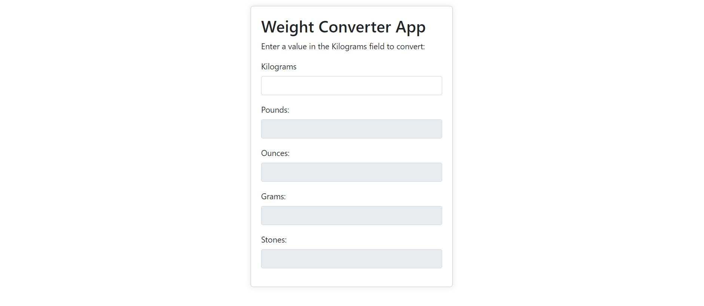

# Weight Converter App - GitHub Repository



## Description

The Weight Converter App is a simple yet powerful web application that allows users to convert weight measurements from kilograms to pounds, ounces, grams, and stones. This app is designed to make weight conversions quick and effortless, catering to a wide range of scenarios, from cooking enthusiasts working with international recipes to fitness enthusiasts monitoring their progress.

## Features

- Intuitive User Interface: The app provides a user-friendly interface, making it easy for users to input weight values and view the converted results.
- Real-time Conversion: As soon as the user enters a value in kilograms, the app dynamically calculates and displays the equivalent weight in other units, including pounds, ounces, grams, and stones.
- Responsive Design: Built using Bootstrap, the app is fully responsive, adapting seamlessly to various screen sizes and devices.
- Error Handling: The app includes robust error handling to ensure smooth user experience, gracefully handling any unexpected inputs.

## Technologies Used

- HTML: Provides the structure of the app's user interface.
- CSS: Styles the app's appearance and layout.
- JavaScript: Powers the dynamic weight conversion functionality.
- Bootstrap: Ensures a responsive and visually appealing design.

## Usage

1. Open the Weight Converter App in your web browser.
2. Enter a value in kilograms in the "Kilograms" field.
3. The app will automatically display the converted values in the "Pounds," "Ounces," "Grams," and "Stones" fields.
4. To clear the conversion, simply delete the input value.

## Live Demo

Check out the live version of the app: [Live Demo](https://adwebtechnology.com/weather/Weight_converter_app.html)

## Getting Started

To run the Weight Converter App locally on your machine, follow these steps:

1. Clone the repository to your local system using the following command:

```bash
git clone https://github.com/Chhote04/Weight_converter_app.git
```

2. Open the index.html file in your web browser.

## Contributions

Contributions to the Weight Converter App are welcome! If you find any issues or have suggestions for improvements, feel free to open an issue or submit a pull request.

## Contact

For any questions or inquiries, you can reach me at [jatav.developer@gmail.com](jatav.developer@gmail.com).

Thank you for checking out the Weight Converter App repository! Happy converting! 🚀💻
